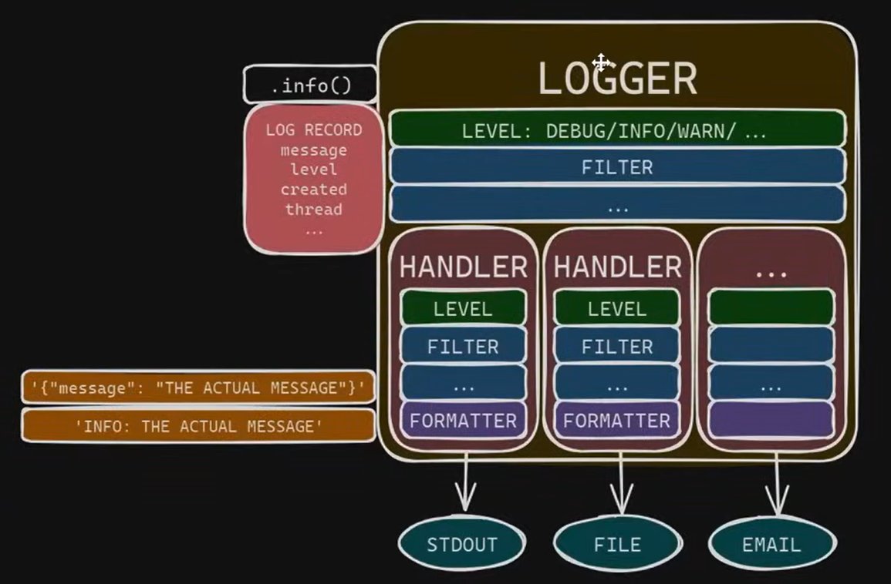

# Logging TIPS and TRICKS  
Ref: [mCode - Modern Python Logging Video](https://www.youtube.com/watch?v=9L77QExPmI0)  

### Dependencies
```
pip install pyyaml
```

Usually should log to at least 2 outputs : Console and Files  
Logging is blocking, so implement threads to manage it (see mCode for details)   

FILTERS  
FORMATTERS  
HANDLERS  
LOGGERS  
  
Image for Root Logger


Recommendation:
- Put all loggers on the root logger or handlers
- Leave propagation ON (default) so all loggers send to root
- Don't use the root logger in the code  
-- logging.info("some message") : uses the root logger
-- logger = logging.getLogger("MyLoggersName) : Better practice

Example of logging comfiguration
```python
import logging

logger = logging.getLogger("MyLog")

logging_config = {
    "version": 1,
    "disable_existing_loggers": False # Receive logs from all modules and third party software
    # "filter": {},
    "formatters": {
        "simple": {
            "format" : "%(levelname)s : %(message)s"
        }
    },
    "handlers": {
        "stdout": {
            "class": "logging.StreamHandler",
            "formatter": "simple" # Refers to the formatter defined above
            "stream": "ext://sys.stdout",
        }
    },
    "loggers": {
        "root": {"level": "DEBUG", "handlers": ["stdout"]}
    }
}

def main():
    logging.config.dictConfig(config = logging_config)
    
    logger.addHandler(loggin.StreamHanlder()) # Log ot stdout
    logger.debug('Debug message')
    
``` 

[Log Record Attributes](https://docs.python.org/3/library/logging.html#logrecord-attributes) : List of attributes available for formatting  

Implement a subfolder for logging configs and place root level cofigs in seperate JSON oe YAML files.  
- YAML requires pyyaml to be installed with pip install pyyaml
